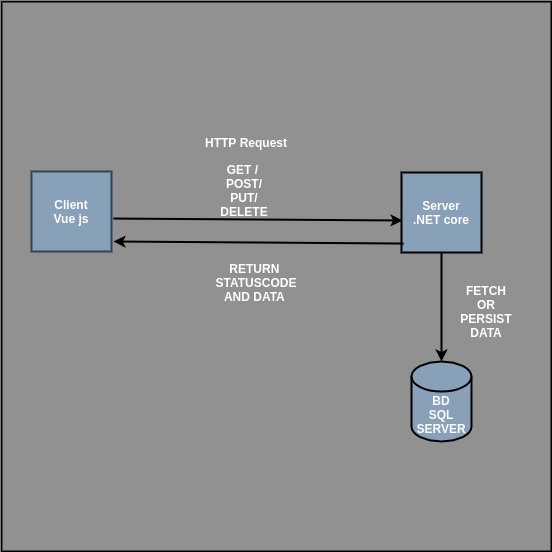
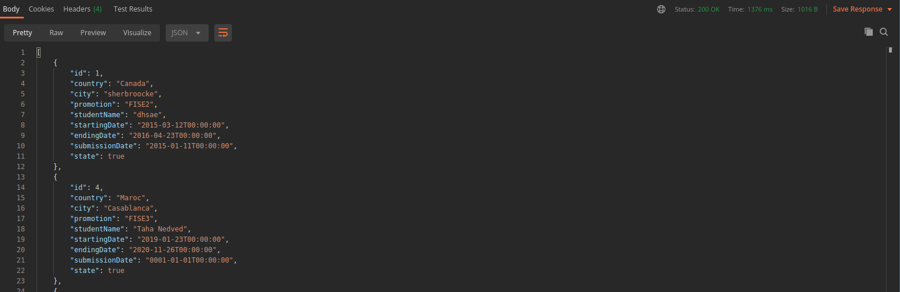
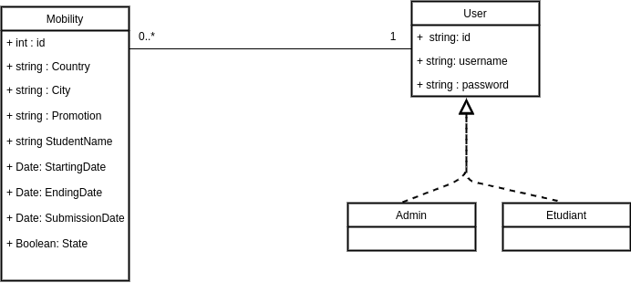
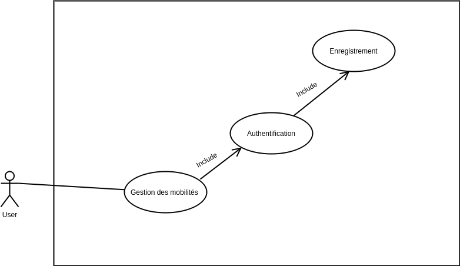

# Documentation projet mobilité TSE

**lien vers le backend :** [SERVEUR ](https://github.com/TahaAlamiIdrissi/mobility-back)<br>
**lien vers le frontend :** [CLIENT ](https://github.com/TahaAlamiIdrissi/mobility-front)


#### Table des matières

1. [ Architecture. ](#archi)
2. [ Choix des technos. ](#technos)
3. [ Lancement en interne. ](#launch)
4. [ Screencast. ](#video)


<a name="archi"></a>
## 1. Architecture



### Que se passe-t-il du côté de notre serveur?

Dans notre serveur (.Net core) nous mettons en place une API Rest qui s'occupe de : 
* Créer une mobilité
* Chercher une mobilité ( id)
* Chercher toutes les mobilités
* Modifier une mobilité
* Supprimer une mobilité
* Authentification et Enregistrement d'un Utilisateur

Ce serveur est relié à une base de donnée (SQL SERVER) comme suit
```c#
// Injection des dépendances 
services.AddDbContext<AuthDbContext>(options => options.UseSqlServer(this._config.GetConnectionString("Auth")));
```
Dans le fichier appsettings.json on peut trouver :
```json
"ConnectionStrings": {
    "Auth": "Server=localhost;Database=Auth;User Id=SA;Password=******"
  }
```
via les méthodes misent en place, le serveur éffectue des opérations sur la base de données comme par exemple la pérsistence des données:
```c#
public Mobility AddMobility(Mobility mobility)
{
    this._context.Mobilties.Add(mobility);
    this._context.SaveChanges();
    return mobility;
}
```
Cette gestion de la base de donnée se fait en créant un contexte ( AuthDbContext) qui s'occupera de faire la liaison avec la BD.
Et grasse au système d'injection des dépendances de .Net core qui est assez simplifié, on pourra avoir accés à la ressource (BD) dans toute notre arborescence.

Exemple d'injection des dépendances pour la ressource (Mobility)
```c#
services.AddTransient<IMobility,MobilityService>();
```

Comme retour, notre seveur renvoi des réponses qui sont sous le format **<Data,StatusCode>**



### Conception



Contexte : un étudiant peut créer (faire une demande de) une mobilité, l'admin s'occupe de la valider et d'avoir une vue global sur ces étudiants dans une map.
l'étudiant peut aussi modifier ces informations.

Aucune des actions ne peut être éffectuée si l'utilisateur ne s'est pas authentifié.

#### Système d'authentification



* Création d'un compte
* Récéption d'un email 
* Confirmation de l'adresse mail
* Authentification -> Accés aux fonctionalités

pour ce projet nous utiliserons un serveur mail de test : **mailtrap.io**

```json
// fichier appsettings.json
"Email":{
    "Server":"smtp.mailtrap.io",
    "Port":"2525",
    "SenderName":"AuthService",
    "SenderEmail":"auth_service@service.fr",
    "Account":"************",
    "Password":"************"
  }
```

*l'authentification se fait à l'aide de JWT* : **jsonwebtoken**

Un jeton se compose de trois parties :

* Un en-tête (header), utilisé pour décrire le jeton. Il s'agit d'un objet JSON.
* Une charge utile (payload) qui représente les informations embarquées dans le jeton. Il s'agit également d'un objet JSON.
* Une signature numérique.

la **géneration** du jetons se fait lors de l'authentification comme suit :

```c#
public string GenerateJwtSecurityToken(IdentityUser user,Task<IList<string>> roles)
        {
            // generate the jwt token and send it in the response 
            /* string issuer = null, string audience = null, IEnumerable<Claim> claims = null, DateTime? notBefore = null, DateTime? expires = null, SigningCredentials signingCredentials = null */
            var claims = new[]
            {
                new Claim(JwtRegisteredClaimNames.Sub,user.Id),
                new Claim(JwtRegisteredClaimNames.Email,user.Email),
                new Claim(ClaimTypes.Role,roles.Result.FirstOrDefault())
            };
            var securityKey = new SymmetricSecurityKey(Encoding.UTF8.GetBytes(this._config["Jwt:SecretKey"]));
            var signingCredentials = new SigningCredentials(securityKey, SecurityAlgorithms.HmacSha256);

            var securityToken = new JwtSecurityToken(
                this._config["Jwt:Issuer"],
                this._config["Jwt:Audience"],
                claims,
                DateTime.Now,
                DateTime.Now.AddHours(2),
                signingCredentials
            );

            var token = new JwtSecurityTokenHandler().WriteToken(securityToken);
            return token;
        }
    }

```


<a name="technos"></a>
## 2. Choix des technos

Les technos utilisées durant ce projet sont :

**Client:**

* Vue js

**Serveur:**

* .Net core 3.1

**Base de donnée**

* SQL SERVER


En ce qui concerne le côté **client**, les raisons de ce choix sont la facilité de mise en place, la versatilité de cette techno en plus de ces performances et enfin son intégration avec le .NET core3.1 .<br>
En effet, la création d’une application se fait en quelques lignes de code et les résultats sont rapidement là.<br>
pour la versatilité, Une application vue js peut être créee en utilisant la cli pour mettre en place un projet tout en entier, ou en utilisant un **cdn** pour intégrer vue js dans notre
projet (HTML/CSS).<br> 
Il permet d'avoir un rendu rapide et une synchronisation de données assez efficace. Certe, La librairie React est plus performante dans ce point, mais aussi plus complexe !<br>
Et enfin, Le stack Vuejs / Net core est amplement utilisé avec un ensemble de ressource assez important (**Stackoverflow**)


Pour ce qui est du côté **serveur**, j'avais le choix entre:

* node js
* spring boot
* .net core

Qui sont tous des technos que je maîtrise parfaitement exceptéle **.net core**, Pour une application que l'on appelle, **I/O intensive** (qui est notre cas) les technos les mieux adaptées étaient le node js et java.<br>
Le c# quant à lui est plus utilisé dans les applications qui nécéssite du calcul **CPU intensive**.<br>
Cependant, le c# propose des concepts qui sont assez puissant sur tous ce qui a un rapport avec la base de donnée comme par exemple  Le **LINQ**.<br>
Pour conclure, Le choix du .NET CORE 3.1 a été fait pour des raisons de montée en conpétence.


Le choix de SQL SERVER, a été fait pour des raisons :

* Intégration avec le .NET CORE
* Puissance et sécurité
* Documentation riche


<a name="launch"></a>
## 3. Lancement en interne

### Client 

```git
git clone https://github.com/TahaAlamiIdrissi/mobility-front
```
installation des dépendances
```npm
npm i 
```
lancement du client
```npm
npm run serve
```
visiter : **localhost:8080**


[lien vers l'image docker ](https://hub.docker.com/repository/docker/alamidrissitaha/mobility-front)
```docker
docker pull alamidrissitaha/mobility-front:v1
```

### Serveur

```git
git clone https://github.com/TahaAlamiIdrissi/mobility-back
```
Installation des dépendances
```dotnet
dotnet clean

dotnet build

dotnet restore
```

Lancement du serveur
```dotnet
dotnet watch run
```
lancer sur : **localhost:5000**

Si on ne dispose pas du **SDK** et du **runtime .NET** ainsi que de **mssql** on peut lancer le serveur dans un conteneur docker<br>
 *j'ai essayé de mettre en place un dockerfile pour le front qui est fonctionel, en ce qui concerne le backend, le docker-compose est fonctionnel mais a besoin de modification au niveau du code*
 
```docker
docker-compose up
```

Reception des mails :

Pour reçevoir des mails, vous devez fournir les informations suivantes :
```json
"Email":{
    "Server":"smtp.mailtrap.io",
    "Port":"2525",
    "SenderName":"<Sender_name>",
    "SenderEmail":"<Sender_mail>",
    // si utilisation de mailtrap ----------------
    "Account":"*********",
    "Password":"************"
    //------------------------------------
  },
```
Dans le fichier appsettings.json **SERVEUR**
<a name="video"></a>
## 4. Screencast

<p align="center">
 <a href="https://youtu.be/56CGnCDs04Y">
  
 </a>
</p>